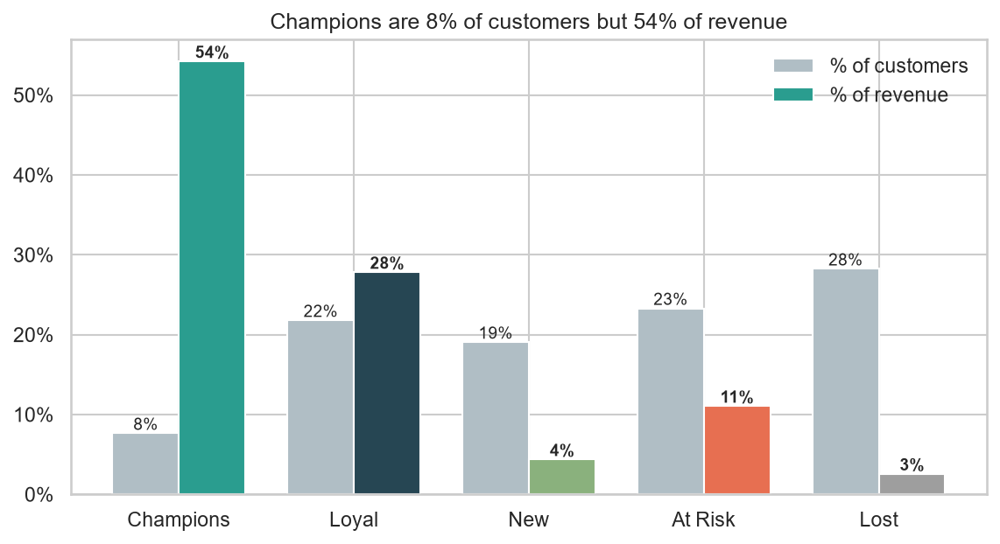
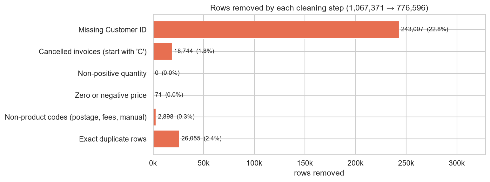
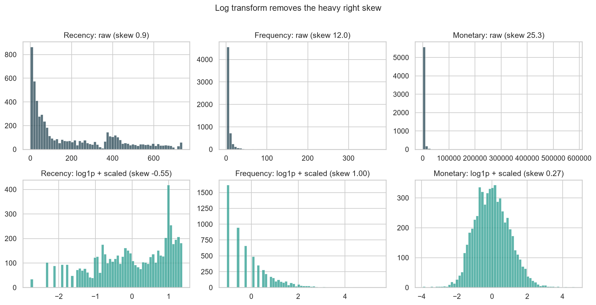
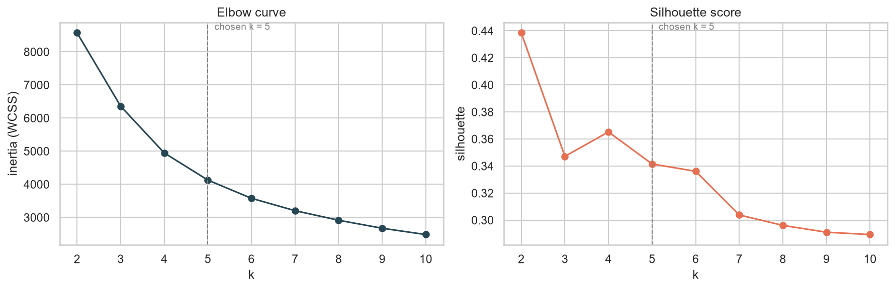
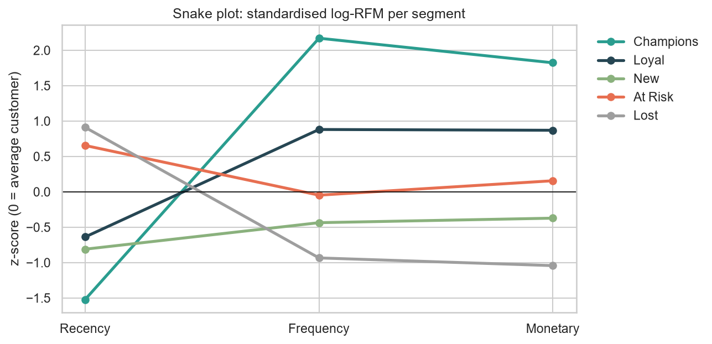
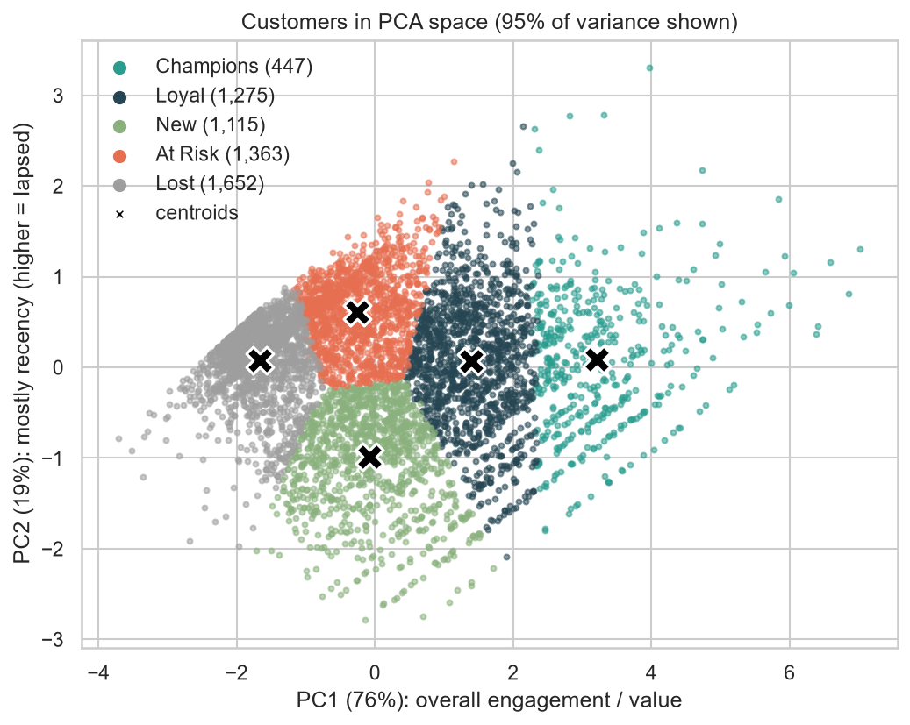
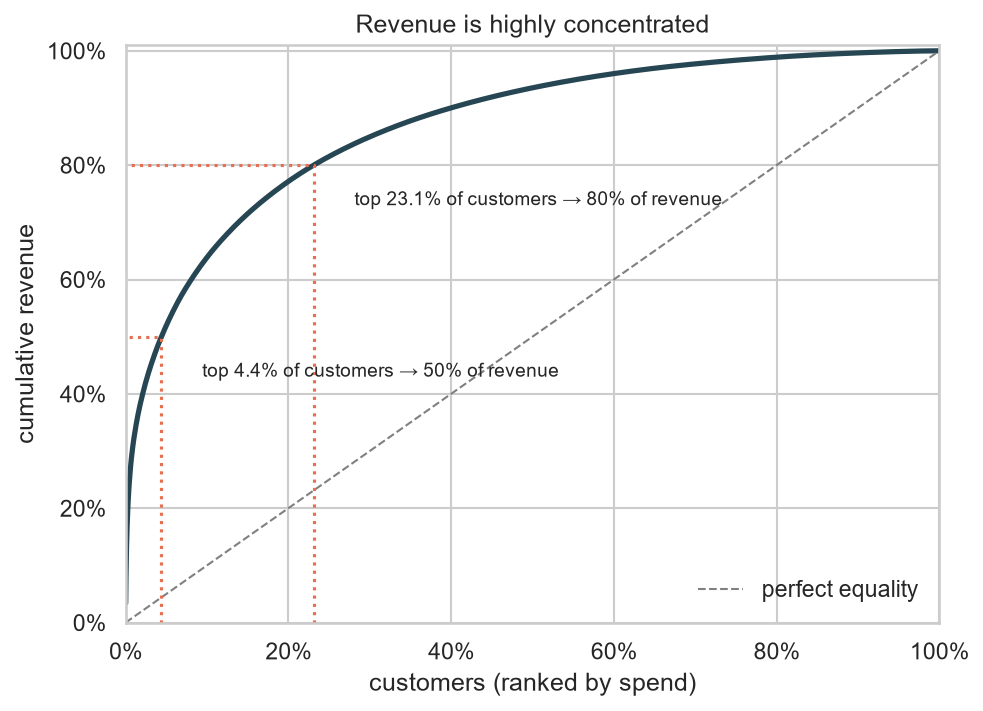
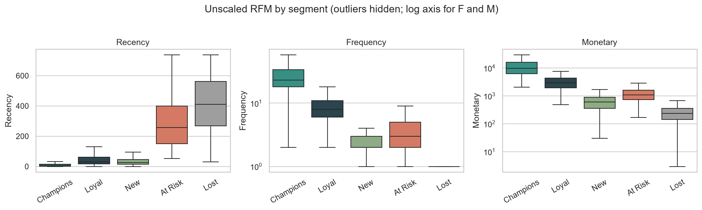
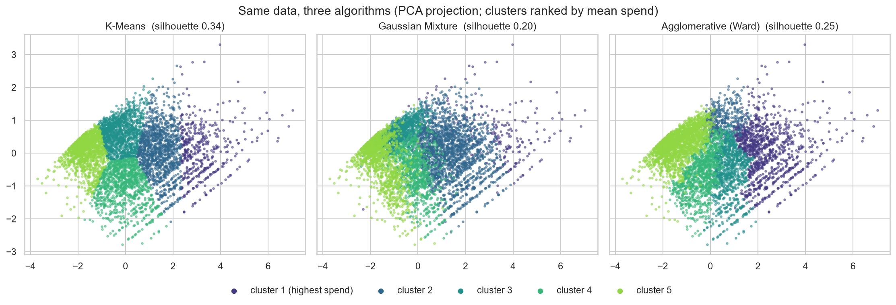
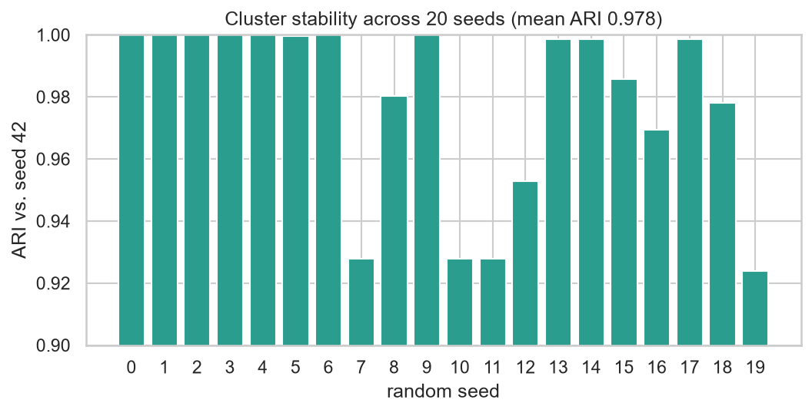

# Customer Segmentation using RFM + K-Means

This project segments **5,852 customers** of a UK online retailer into five actionable groups, using RFM (Recency, Frequency, Monetary) features and K-Means clustering on about 1 million real transactions.

> **Headline:** **7.6% of customers ("Champions") generate 54% of revenue.** The top 10% of customers by spend bring in 64%, and half of all revenue comes from just 4.4% of customers.



---

## Dataset

[UCI Online Retail II](https://archive.ics.uci.edu/dataset/502/online+retail+ii) (CC BY 4.0): 1,067,371 invoice lines from a UK-based online gift retailer between **1 Dec 2009 and 9 Dec 2011**. Many of the customers are wholesalers.

| Column | Meaning |
|---|---|
| `Invoice` | Invoice number; a leading `C` marks a cancellation |
| `StockCode`, `Description` | Product |
| `Quantity`, `Price` | Units and unit price (GBP) |
| `InvoiceDate` | Timestamp |
| `Customer ID`, `Country` | Customer |

The full Excel file (45 MB) isn't committed. Download `online_retail_II.xlsx` from UCI and place it in the project root. A 12-month sample (`data/sample_transactions.csv.gz`) is included for the Streamlit demo.

## Project structure

```
├── main.py              # full analysis, one function per step; prints results, saves charts + tables
├── segmentation.py      # reusable pipeline: load → clean → RFM → scale → K-Means → name segments
├── plots.py             # all chart functions (write PNGs to images/)
├── app.py               # Streamlit app: upload transactions, get segments back
├── images/              # charts produced by main.py
├── outputs/             # CSVs: customer_segments, segment_profile, cleaning_log, k_selection, ...
├── data/                # 12-month sample for the app
└── requirements.txt
```

## Quick start

```bash
pip install -r requirements.txt
python main.py            # ~1–2 min; the first run parses the Excel file and caches it as parquet
python main.py --k 4      # try another number of clusters
python main.py --skip-extras   # skip the model comparison and stability checks
streamlit run app.py      # interactive demo
```

---

## 1. Data cleaning

Real transaction logs are messy. Every step is logged:

| Step | Rows removed | % of raw | Why |
|---|---:|---:|---|
| Raw data | – | – | 1,067,371 rows |
| Missing `Customer ID` | 243,007 | 22.8% | Guest checkouts can't be profiled |
| Cancelled invoices (`C…`) | 18,744 | 1.8% | Returns and reversals, not purchases |
| Non-positive quantity | **0** | 0.0% | Every negative quantity was already a cancellation line |
| Zero or negative price | 71 | 0.0% | Free samples and write-offs |
| Non-product stock codes | 2,898 | 0.3% | `POST`, `DOT`, `M` (manual), `D` (discount), bank charges and similar |
| Exact duplicates | 26,055 | 2.4% | Double-logged lines; the two yearly sheets also overlap on 1–9 Dec 2010 |
| **Clean** | | | **776,596 rows (72.8% kept)** |



## 2. RFM features

One row per customer, measured against a snapshot date of **2011-12-10** (the day after the last invoice):

- **Recency:** days since the customer's last purchase
- **Frequency:** number of unique invoices
- **Monetary:** total spend (Quantity × Price)

`AvgOrderValue` and `Tenure` are also computed to help describe segments. They aren't used for clustering.

## 3. Preprocessing: why log, then scale

K-Means assigns customers to the nearest centroid by **Euclidean distance**, which causes two problems with raw RFM:

1. **Scale.** Monetary runs up to £580k, while Frequency is usually under 10. Unscaled, distance is almost entirely Monetary.
2. **Skew and outliers.** Frequency (skew 12) and Monetary (skew 25) have very long tails of wholesale buyers. K-Means minimises *squared* distance, so a handful of extreme customers drag centroids around and claim whole clusters for themselves, while everyone else gets squashed into one blob.

**Fix:** apply `log1p` to compress the tail (skew drops to about 0), then `StandardScaler` so each feature has mean 0 and SD 1 and gets equal weight. The order matters: scaling alone doesn't change the shape of a distribution.



## 4. Choosing k



| k | Inertia | Silhouette | Davies-Bouldin |
|---:|---:|---:|---:|
| 2 | 8,573 | **0.44** | 0.87 |
| 3 | 6,359 | 0.35 | 1.04 |
| 4 | 4,948 | 0.37 | 0.94 |
| **5** | **4,128** | **0.34** | **0.95** |
| 6 | 3,578 | 0.34 | 0.96 |
| 7 | 3,205 | 0.30 | 0.98 |

The metrics disagree:
- **Silhouette is highest at k = 2.** That split is just "active vs. inactive", which is correct but not useful for marketing.
- **The elbow is soft, around k = 4–5.** Going from 4 to 5 still cuts inertia by about 17%, and gains flatten after 6.
- **k = 5 loses only 0.02 silhouette compared with k = 4**, and silhouette drops sharply from k = 7 onwards.

**I chose k = 5 because the five clusters map one-to-one onto the standard lifecycle segments.** k = 4 merges Champions into Loyal, even though Champions spend 5.5x more. RFM behaviour is a continuum with no natural gaps, so a silhouette around 0.3–0.4 is expected, and the segments are best read as useful cuts of that continuum.

## 5. Segments

K-Means (`k=5`, `random_state=42`, `n_init=10`), profiled on the **original unscaled** values:

| Segment | Customers | Avg recency | Avg orders | Avg spend | % customers | % revenue |
|---|---:|---:|---:|---:|---:|---:|
| **Champions** | 447 | 15 days | 32.8 | £20,702 | 7.6% | **54.2%** |
| **Loyal** | 1,275 | 48 days | 9.2 | £3,724 | 21.8% | 27.8% |
| **New** | 1,115 | 31 days | 2.5 | £668 | 19.1% | 4.4% |
| **At Risk** | 1,363 | 283 days | 3.9 | £1,383 | 23.3% | 11.0% |
| **Lost** | 1,652 | 412 days | 1.3 | £265 | 28.2% | 2.6% |

**Personas**
- **Champions** bought about 2 weeks ago, average 33 orders and over £20k lifetime spend. This is the wholesale core of the business.
- **Loyal** customers are steady repeat buyers, active within the last ~7 weeks with around 9 orders each.
- **New** customers bought recently but only 2–3 times so far. Their average tenure is ~8 months, compared with ~18 months for Loyal customers.
- **At Risk** customers used to buy regularly (around 4 orders, £1.4k) but have been silent for about 9 months.
- **Lost** customers made one small order over a year ago. Most were probably one-off gift buyers.

**How names are assigned.** Each centroid is compared with the average customer. *Recent* means below-average recency; *valuable* means above-average frequency plus monetary. That gives four quadrants, and the highest-value recent cluster becomes Champions. Because the rules use centroids rather than cluster ids, names stay stable when the arbitrary ids change.

### Snake plot and PCA



Champions and Lost are mirror images. At Risk is the line to watch: its frequency and spend are about average, but its recency is much worse than average.



Two principal components explain 95% of the variance. PC1 (76%) measures overall engagement and value, and PC2 is mostly recency. The segments form bands along the value axis, not separate islands.

### Revenue concentration





## 6. Recommended actions

| Segment | Action |
|---|---|
| **Champions** | Reward them: early access to new ranges, a VIP tier and referral incentives. **No discounts needed.** Consider dedicated account management, since 447 customers carry half the revenue. |
| **Loyal** | Upsell and cross-sell: bundles, volume pricing and a loyalty programme to move them up to Champions. |
| **New** | Onboard fast: a welcome series and a time-limited second-order incentive. The jump from 2–3 to about 9 orders is where lifetime value is built. |
| **At Risk** | **Win back now** with a personalised "we miss you" offer based on past purchases, plus a feedback survey. They were worth £1.9M in total, so reactivating 10% recovers about £190k of historical-equivalent spend. |
| **Lost** | Low-cost reactivation only: one seasonal campaign, then suppress them from paid channels. Average value is £265. |

---

## 7. Stretch goals

### K-Means vs. Gaussian Mixture vs. hierarchical clustering



| Model | Silhouette ↑ | Davies-Bouldin ↓ | ARI vs K-Means |
|---|---:|---:|---:|
| **K-Means** | **0.34** | **0.95** | 1.00 |
| Agglomerative (Ward) | 0.25 | 1.17 | 0.44 |
| Gaussian Mixture | 0.20 | 1.28 | 0.40 |

**K-Means gives the best-separated segments.** The other algorithms agree on the extremes but not on the middle of the value continuum:
- **Ward** puts 100% of the Champions into its top cluster and 95% of Lost customers into its bottom cluster.
- **Ward and the GMM split Loyal, New and At Risk customers differently from K-Means and from each other.**
- **The GMM fits overlapping elliptical components.** One of them absorbs 94% of Loyal customers and 61% of Champions.

The takeaway: **the ranking of customers by value is robust across algorithms, but the exact boundaries between neighbouring segments are a modelling choice.** That supports picking k and the boundaries based on business use.

### Stability across random seeds



I refitted K-Means with 20 different seeds. The mean Adjusted Rand Index against the reference model is **0.98** (minimum 0.92), and **99%** of customers keep the same segment name on average. The segmentation isn't an artefact of initialisation.

### Streamlit app

`streamlit run app.py` starts a small app:
- **Upload** transactions (`.xlsx`, `.csv` or `.parquet`), or use the bundled 12-month sample.
- **Choose k** with a slider.
- **See the results:** a segment profile table, a customers-vs-revenue chart, a recency-vs-spend scatter and the cleaning log.
- **Download** each customer's segment as a CSV.

The app accepts both the Online Retail II column names and the original Online Retail (I) names (`InvoiceNo`, `UnitPrice`, `CustomerID`).

## Limitations and next steps

- **Guest checkouts are excluded.** 23% of lines have no Customer ID, so they can't be segmented.
- **Many customers are wholesalers,** which inflates Champion spend. In production, B2B and B2C customers should be segmented separately.
- **Segments are a snapshot.** Refreshing them monthly and tracking movement between segments (e.g. Loyal → At Risk) would give an early-warning churn signal.
- **Recency is measured from one fixed date.** A proper churn model, such as BG/NBD with Gamma-Gamma for CLV, would estimate each customer's probability of still being active.
